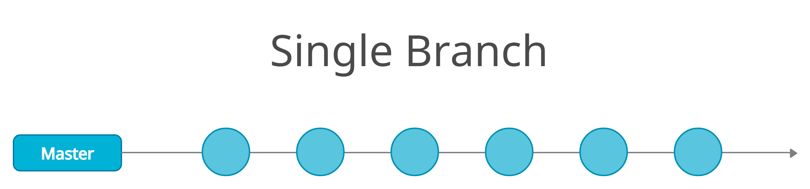
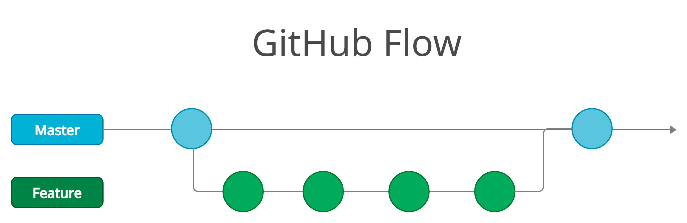
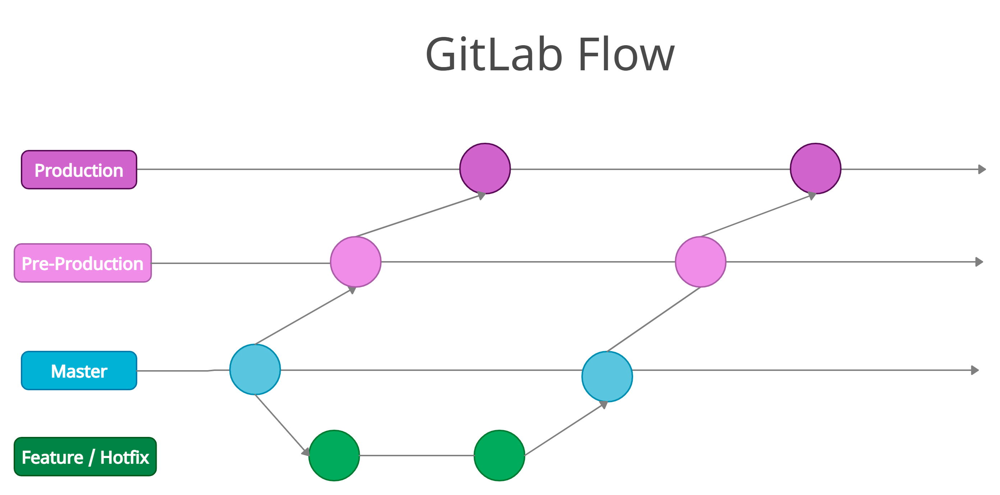

**Branching** is the term used to describe the idea of **deviating** from the default branch.
In computer science  means you diverge from the main line of development and continue to do work without messing with that main line. 
In many version control software this is an expensive process, often requiring you to create a new copy of your source code directory, which can take a long time for large projects.

But in Git this process is incredibly lightweight, making branching operations nearly instantaneous, giving the ability to switch between branches just as fast.
This way people that use Git branch and merge more often, even more than once a day.

Specificaly, I'll to focus on project branching with [**GitHub**](https://github.com/).

Here I will explain *why* is useful, *when* you should implement it, and *how* you can do it using GitHub.

I'm also going to introduce you to some Branching models and compare them. 

# Why ?

When starting using VCS people usually starts by committing all the changes in main, and using only this branch. This can look like a good idea, but as you develop bigger and bigger projects, you will face some conflicts, usually when working with other people. I'm not saying that you shouldn't use Single Branch Flow, it has it's own public, and sometimes even it's used in small group projects, I will explain more about the most used models below.

What I mean is that, understanding and mastering this feature gives you a powerful and unique tool and can entirely change the way that you develop, and you should learn as soon as possible, so in the future you can know when it's necessary or not. 

### Pros

- Branching allows you to isolate the work from the main branch, so in case of a problem only one branch is affected.
- When a change is committed is guaranteed that it works correctly, this makes easier to manage the repository.
- Simplifies the QA and bug fix process
- Limits who can contribute to each branch
- Ensures that a change to a branch must be reviewed, even selecting how many people must review it before the commit gets implemented
- In Git branches don't generate additional copies of the files when they are created, so they are cheap to create.
- Ability to share branches without having to merge the changes into the main project
- More Agile workflow

### Cons

- For very small projects it makes the process more complicated
- There isn't a "one fits all" Flow model, each one has its advantages and disadvantages

# When ?

It is always **recommended** to use a branch strategy, even if the project is very small, due to all the advantages it has compared to the small amount of cons.

Referring to the specific moment to implement it on a project, is suggested to do it **as soon as possible**, but having in mind already what model are you going to use.

The process of selecting the model of branching must be chosen by the management and production teams, that have the ability to tell the magnitude of the project and how it's going to affect the development.

If you are not sure if you need a new branch, create one anyway, because it's easier to create a branch and then merge it, then move a commit from one branch to another.

So, to sum up, **create a branch when you are going to work on something new.**


# How ?

The branches don't generate copies of the files from the source, they use commit history information to recreate the files of a branch when you work on it, this concept makes it easier to switch between branches at any moment.

## Step By Step Process

**1. Open the branch selector**

GitHub Desktop has a Dropdown button that allows you to see and change what branch do you want to work in.


**2. Select the "*New branch*" option**

If the branch is already created, just select the specific branch you want to work in.


**3. Give an appropriate name to the branch**

Use a consistent naming convention for your feature branches to identify the work done in the branch. You can also include other information in the branch name, such as who created the branch:

```
feature/feature-name
hotfix/description
users/username/workitem
```


**4. Switch the branch you want to work in, here you can also bring the changes to the new branch**

If you already made the changes, but forgot to create a branch you can import the changes to the new branch with any problems.


**5. Publish the new branch to the repository**

Publishing a branch makes it public to the contributors of the project, so now the branch is officially made.


**6. Create a Pull Request**

When all the changes are done the branch can be merged, but before doing it you first have to create a pull request, this works as a safety measure, the request must be accepted before it can be merged to the father's branch.


**7. Open the Pull Request**

When opening a pull request you can write some description about the request and select the type of request, between pull request and draft pull request.

Pull request it's a request that can be merged with or without a revision. While a draft pull request it's not ready to review yet. Can only be merged after they are marked as ready for review. This is useful because pull requests are often used as conversations, often prior to the work being ready to merge.

Also, before opening the request you can also specify who has to review it, who is assigned to this pull request, give it some labels, projects, milestones or linked issues to simplify the work of reviewing.

To clarify, assignees are the ones who work on specific issues and pull requests. They are sometimes confused as reviewers. They are actually meant to be used with issues rather than pull request so that when we receive an issue we can assign someone to fix it. They are in charge of merging that pull request after getting comments and change requests from other maintainers.


**8. Merge the Pull Request to the Branch**

In the Pull Request tab you will find all the information about the request, first you have the Conversation tab where all the communication between reviewers and assignees is found. In the commits tab there are all the Commits that were added to that branch. You can see everything that has been checked in the Checks tab. Finally, in the Files Changed tab there is a log of how each file has changed during the review.


# Most used Branching Models

## Single Branch (Master-only Flow)


- Development and Production all it's in the Master branch
- Teams need to trust each other, if not, this model I wouldn't recommend this model
- Simple
- Agile
- All the commits are based on the use of Feature Flags*

`* Feature Flags that allow you to enable or disable a new feature, often used to avoid conflicts when merging.`

## GitHub Flow (Feature Branching)



- Development, Production and Pre-Production environment are found in the Feature branch
- Everything is done in the Feature branch, even deployment, in case of a bug the Master branch can be used.
- Production is also done in the Master branch.
- Master is always deployable and acts like a safety measure
- Works very well with Continuous Deployment*
- Clean Commit History

`* Continuous Deployment is a software release process that uses automated testing to validate if changes to a codebase are correct and stable for immediate autonomous deployment to a production environment.`

## Git Flow


- Every environment has its own branch, Development has the Feature branches, Pre-Production has the Develop branch and Production is done in the Release branch
- Has many branches Master + Develop + Feature Branch + Release Branch + Hotfix Branch
- Complex
- Great for release-based workflow 
- The most famous model
- Not recommended for small projects
- Messy Commit History


## Release Flow


- Develop environment is done in the Topic branch and Production in the Releases branch
- System developed by Microsoft
- Topics are like mini features 
- Releases every 3 weeks, so topics done during the day 1 aren't added to production until 3 weeks later
- Model used to manage massive development teams
- In case of a hotfix, it can be integrated to Master and then a special deploy can be done to the Releases branch

Microsoft has stated that they do that because their teams in a day can integrate 200 pull requests and every release (3 weeks) they deploy 3000 pull requests.


## GitLab Flow


- Development is managed in Feature/Hotfix branch, Pre-Production and Production in their own branches
- Similar to GitHub Flow at first sight, but more complex when you dive into it
- Not as Agile as other methods
- When a feature arrives to production its more reliable
- Recommended for projects where you can't allow yourself to fail, a good example could be a bank software, where a bug could cause people losing money 
- In case of a hotfix, it can be integrated into production by cherry-picking
- Forbidden to commit in master directly

## Trunk-Based Development


- The Development can be done in the Feature branches, but also in the Master. Production is usually done in Master, but sometimes you can have a Releases branch 
- Similar to GitHub Flow, but you first commit a feature to Master and then it can be deployed, while in GitHub flow the deploy is done on the Feature branch
- Master branch can develop with the use of Feature Flags, as seen in the Single Branch Flow
- Release branches can be used when you are doing a deployment, but also want to continue the development, for example, when deploying to a mobile store the approval process can take some days or even weeks, you want to continue the development, so you add a Release branch.
- Master is always deployable

# Conclusion

To sum up everything that has been stated so far I would say that, using branching policies is a "must" because the small number of Cons its nothing compared the large amount of Pro, try to always use branching, but don' feel forced to use it, experiment by creating a branch in your repository and exploring its possibilities, and test the different models because each one has its application. 
But my recommendation for the Project 2 subject would be to use one of these 3:

- **Single Branch:** You probably already used it in Project 1, Development and other subjects in the degree, but maybe now you can use it at its true potential. I would focus on the idea of using Feature Flags so the everyone can work at the same time without stepping on other people work.

- **GitHub Flow:** It's easier to manage than a Single Branch flow, and also is a great introduction to branching for the first time. The ability to isolate the work can be also useful so you don't have to worry about Feature Flags.

- **Trunk-Based Development:** For this Flow I would repeat the same advantages from GitHub flow, I would say it's a matter of preference, if you want to deploy from the Features Branch (GitHub Flow) or from Master branch (Trunk-Based Development)

# References
- [Class presentation]() in PDF

- [Git Flow](https://www.atlassian.com/git/tutorials/comparing-workflows/gitflow-workflow)
- [Main branch information](https://docs.microsoft.com/en-us/azure/devops/repos/git/branch-policies-overview?view=azure-devops)
- [Explanation of branching use](https://git-scm.com/book/en/v2/Git-Branching-Branches-in-a-Nutshell)
- [Concept explanation](https://www.atlassian.com/continuous-delivery/continuous-deployment#:~:text=Continuous%20Deployment%20(CD)%20is%20a,cycle%20has%20evolved%20over%20time.)
- [Branch models (Spanish)](https://www.youtube.com/playlist?list=PLZVwXPbHD1KM5oLAmhz-HHRIMhaOEXku5)
- [Creative Branching Models for Multiple Release Streams](https://www.youtube.com/watch?v=bCU_D7EHqLg&t=1563s)
- [Creately](https://creately.com/)

Go [Up](https://osvak.github.io/Branching-Policies/)
